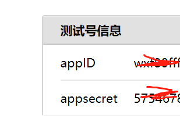
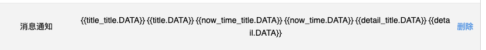
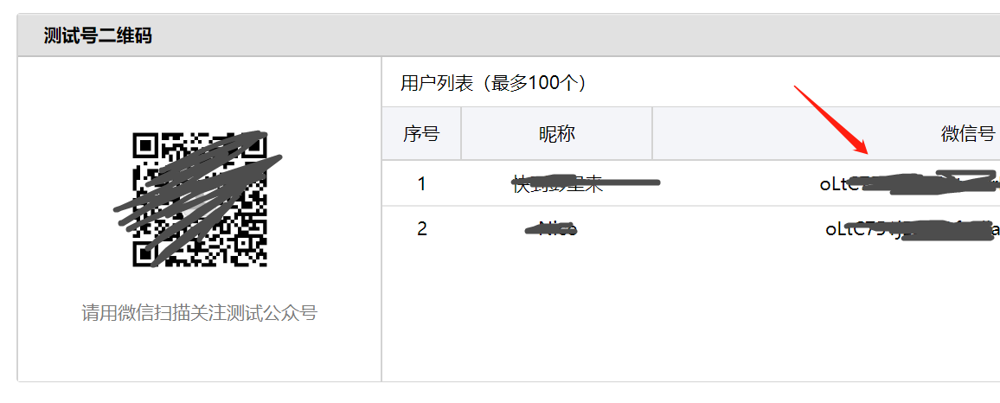

# biliup_rsspush_wechat

这是一个检测bilibiliup主动态，自动推送到微信测试号的py脚本

### 前置：

需要有docker环境，并且安装docker-compose，可以查看[我的初始化脚本](https://gitee.com/buyfakett/centos7_initialization/blob/master/initialization.sh)中的install_docker方法来安装

### 运行：

```bash
git clone https://gitee.com/buyfakett/biliup_rsspush_wechat.git
cd biliup_rsspush_wechat
```

```bash
vi config.yaml

# 检测的主播
uid: 11073
# 检测的时间(分钟）
detection_time: 1 * 60

# 钉钉推送还是微信测试号推送(钉钉：ding，微信测试号：wechat)
send_type: ding
# 钉钉参数
access_token: 259
# 钉钉自定义关键词
ding_keyword: test

# 微信测试号参数
# 模板id
template_id: fE51ho
# rsshub服务的ip
ip: 0.0.0.0
# appId
app_id: wxd4072
# appSecret
app_secret: 64ff49a3631c
# 发送的用户的id
to_user_ids:
- 212
- 34343


在微信公众号测试平台的模板为：
{{title_title.DATA}} {{title.DATA}} {{now_time_title.DATA}} {{now_time.DATA}} {{detail_title.DATA}} {{detail.DATA}} 
```

### 启动容器

```bash
docker-compose up -d
```


#### 关于微信公众号测试平台的内容的说明：

1、AppID和appSecret在微信公众号测试平台网站最上方

  

2、模板ID在添加模板后生成

  

3、用户ID在扫码关注后生产

  

觉得作者写的不错的话可以支持一下作者，请作者喝 咖啡哦~

| 支付宝                                                       | 微信                                                         |
| ------------------------------------------------------------ | ------------------------------------------------------------ |
|  |  |